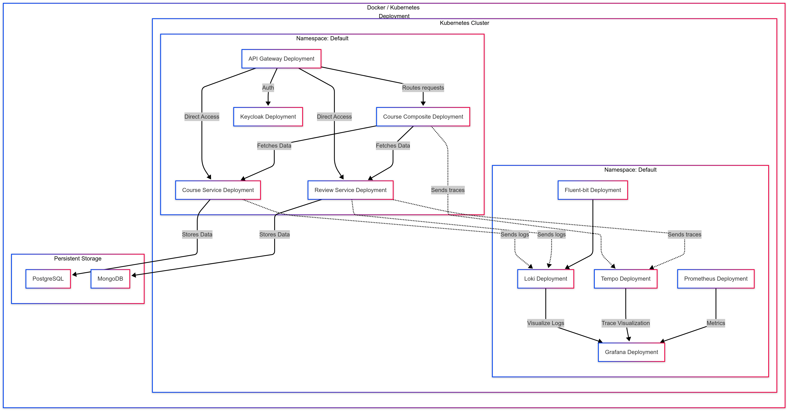

# Spring Boot Based Microservices

A modular, production-style microservices reference project for managing **courses** and **reviews** with strong focus on:

- API gateway routing
- OAuth2/OIDC security with Keycloak
- Observability (metrics, logs, traces)
- Docker Compose and Kubernetes/Tilt local deployment workflows

---

## Table of Contents

- [Overview](#overview)
- [Architecture](#architecture)
- [Tech Stack](#tech-stack)
- [Prerequisites](#prerequisites)
- [Quick Start (Docker Compose)](#quick-start-docker-compose)
- [Run with Kubernetes + Tilt](#run-with-kubernetes--tilt)
- [Core Endpoints](#core-endpoints)
- [Keycloak](#keycloak)
- [Observability](#observability)
- [Troubleshooting](#troubleshooting)

---

## Overview

The system is split into domain services and platform components:

- **Gateway Service**: entry point and request routing
- **Course Service**: manages course data in PostgreSQL
- **Review Service**: manages review data in MongoDB
- **Course Composite Service**: aggregates course + review responses
- **Keycloak**: identity provider for authn/authz
- **Observability stack**: Prometheus, Grafana, Loki, Tempo, Fluent Bit, OpenTelemetry Collector

---

## Architecture

### Context Diagram


### Container Diagram


### Component Diagram


### Deployment View


---

## Tech Stack

- **Java 17**, **Spring Boot**, **Spring Cloud Gateway**
- **PostgreSQL** (Course Service)
- **MongoDB** (Review Service)
- **Keycloak** (OAuth2/OIDC)
- **OpenTelemetry**, **Prometheus**, **Grafana**, **Loki**, **Tempo**, **Fluent Bit**
- **Docker Compose** and **Kubernetes (Minikube + Tilt)**

---

## Prerequisites

Install the following before running:

- Java 17+
- Maven 3.8+
- Docker + Docker Compose
- (Optional) Minikube + Tilt for Kubernetes mode
- curl or HTTPie for API validation

---

## Quick Start (Docker Compose)

> Make sure Docker Engine is running.

### 1) Start databases

```bash
cd docker
docker compose -f docker-compose-infra.yml up --build
```

### 2) Start observability stack

```bash
cd docker
docker compose -f docker-compose-observability.yml up --build
```

### 3) Start microservices

From repository root:

```bash
sh run.sh docker
```

or

```bash
sh run.sh
```

---

## Run with Kubernetes + Tilt

### 1) Start Minikube

```bash
minikube start \
  --profile=microservice-deployment \
  --memory=4g \
  --cpus=4 \
  --disk-size=30g \
  --kubernetes-version=v1.31.0 \
  --driver=docker
```

### 2) Enable ingress

```bash
minikube addons enable ingress --profile microservice-deployment
```

### 3) Use Minikube Docker daemon

```bash
eval $(minikube -p microservice-deployment docker-env)
```

### 4) Build images

```bash
sh build-images.sh
```

### 5) Start platform with Tilt

```bash
tilt up
```

Optional check:

```bash
tilt get uiresources
```

---

## Core Endpoints

> Ports and hostnames depend on your local setup (Docker vs Kubernetes ingress).

Typical routes exposed through the gateway:

- `GET /course`
- `POST /course`
- `GET /review`
- `POST /review`
- `GET /course-composite/{courseId}`

Actuator/metrics examples:

- `GET /actuator/health`
- `GET /actuator/prometheus`

---

## Keycloak

Keycloak is used as the identity provider for user authentication and token issuance.

Typical local flow:

1. Open Keycloak admin/UI.
2. Ensure realm, clients, and users are configured.
3. Get a bearer token from Keycloak.
4. Call gateway APIs with `Authorization: Bearer <token>`.

---

## Observability

### Prometheus
- Check service targets are **UP**.
- Scrape metrics from `/actuator/prometheus`.

### Grafana
- Use dashboards for metrics/logs/traces correlation.

### Fluent Bit + Loki
- Fluent Bit forwards service logs to Loki.

### Tempo + OpenTelemetry
- Services export traces through OTel collector to Tempo.

---

## Troubleshooting

- **Services fail to start**: verify dependent containers (PostgreSQL, MongoDB, Keycloak) are healthy.
- **Auth issues (401/403)**: check token expiration, client config, and realm roles in Keycloak.
- **No logs/traces/metrics**: ensure Fluent Bit, OTel collector, Prometheus, Loki, and Tempo are running.
- **Kubernetes image pull issues**: confirm you built images in Minikube Docker context (`docker-env`).

---

## Notes

- This README focuses on readable setup and operational flow.
- Architecture diagrams remain in `notes/images`.
